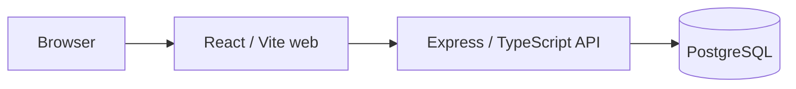
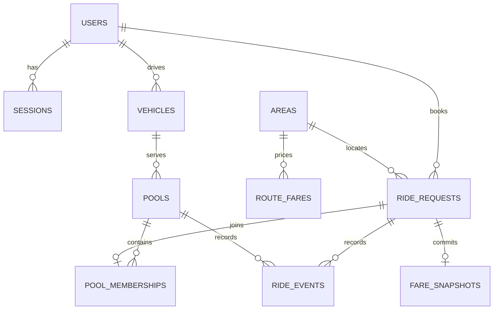

# Dhaka Tesla Pool

Share a seat. Split the fare. Survive Dhaka traffic.

Nusrat and Rafiq can request overlapping Banani trips and share Jashim's three-passenger-seat Bullet. The system allocates compatible requests without overbooking; Jashim decides when to accept and run a trip. Each passenger sees only their own state, estimate and accepted fare. Shirin can take the third seat, or wait when Bullet is full. This is the merged Phase 1–6 MVP on a Phase 7 `pre-release` integration branch, not a public release.

## What works

- Passenger signup, signin, session restoration, supported-area booking with 1–3 seats, indicative estimate, own live status, permitted cancellation and history.
- Driver signin, Bullet availability, assigned pool and **Relevant Ride Requests**, acceptance, arrival, start, completion and history.
- Deterministic same-pickup matching: the seeded Banani → Mohakhali and Banani → Gulshan 1 requests can share an `OPEN` pool. An online idle Bullet starts one; incompatible, full or unavailable cases stay `REQUESTED`/waiting. Online, seat release and completion synchronously retry waiting requests.
- Individual integer-poysha fares, 20% zone-charge discount when at least two distinct requests are active at acceptance, immutable accepted snapshots, cash only. A cancelled pre-start request owes zero cash.
- Server-owned state transitions, scoped reads and writes, persistent events, and PostgreSQL `READ COMMITTED` transactions. Vehicle → pool → request row locks and a fresh seat count enforce Bullet's three-seat limit under concurrent allocation.

The web UI has loading, error and empty states and role-protected routes. It polls active state while visible. No client action can set a ride or pool status directly. There are no real maps, distance estimates, payment gateway or live tracking.

**Screenshots/GIFs:** none supplied or captured for this branch. No image is presented as a verified product screenshot.

## Architecture and data



One modular monolith owns authentication, ride requests, matching, driver actions and fares. The Nginx web container proxies `/api` to the API, keeping the HttpOnly session cookie on the same origin. State changes and corresponding history events commit in one database transaction.



`0001_auth.sql` creates users/sessions; `0002_ride_domain.sql` creates areas, versioned tariffs, vehicles, requests and events; `0003_pooling.sql` creates pools/memberships and pool events; `0004_driver_flow.sql` creates immutable accepted fare snapshots. UUID keys, foreign keys, checks, a unique active request per passenger, one nonterminal pool per vehicle, and one membership per request guard the schema. Capacity is a cross-row transaction invariant. See [architecture and schema](docs/architecture.md), [approved assumptions](docs/assumptions.md), [API](docs/api.md), [auth design](docs/auth.md) and [PRD audit](docs/traceability.md).

## Stack and choices

| Choice | Why for this MVP | Realistic alternative and switch criterion |
| --- | --- | --- |
| React, TypeScript, Vite, React Router | Small authenticated passenger/driver app with client-side routing | Next.js if server rendering or public search pages become necessary |
| Node.js 24, Express, REST, Zod | Direct HTTP contracts and domain modules without extra framework layers | Fastify for measured throughput needs; NestJS for a substantially larger API team; GraphQL for demonstrated cross-client query needs |
| PostgreSQL 17, raw parameterized `pg`, numbered SQL migrations | Row locks, transactions and partial unique indexes make seat allocation inspectable | An ORM if schema/query maintenance outweighs SQL clarity; a different relational DB only with equivalent locking/integrity guarantees |
| Argon2id, DB-backed opaque HttpOnly sessions | Password hashing, server-side revocation and no browser token storage | External identity provider if managed identity or federated login becomes required |
| Plain CSS | Few screens and no design-system dependency | Component library when screens and shared controls grow |
| Vitest, Supertest, Testing Library, PostgreSQL integration tests | Exercise API boundaries, browser flows and real last-seat races | Browser end-to-end runner if deployment regression coverage becomes necessary |
| Docker Compose with Nginx web proxy | Reproducible three-service local deployment, single web origin | A verified free static web plus free API/Postgres host if an available plan supports persistent DB, HTTPS, secrets and cold-start limits |

## Project layout and prerequisites

- `apps/web`: React pages, session context, shared components, API client and frontend tests.
- `apps/api/src/modules`: auth, rides, matching and driver domains; `apps/api/migrations`: versioned SQL; `apps/api/tests`: API and PostgreSQL tests.
- `infra/api`, `infra/web`, `compose.yaml`: API/web images, Nginx proxy and PostgreSQL service.
- `docs`: rules, state machines, contract and requirement audit.

Use Node.js 24 and npm; Docker Engine with Compose is required for the documented container path. Copy [.env.example](.env.example) to an ignored `.env`, set a private `POSTGRES_PASSWORD` and a strong private `AUTH_DEMO_PASSWORD` (12–128 characters). Never commit either value. `POSTGRES_USER`, `POSTGRES_DB`, `POSTGRES_PORT`, `API_PORT`, `WEB_PORT`, `NODE_ENV`, `APP_ORIGIN` are also documented there. For local Compose, `APP_ORIGIN` must match the web URL exactly; for a public HTTPS deployment set `NODE_ENV=production`, use HTTPS and set `APP_ORIGIN` to the exact HTTPS origin. A public reverse proxy/TLS and network policy must be configured by the operator; this repository does not provision them.

## Start, migrate and seed

```sh
cp .env.example .env
# Edit .env with private local passwords.
npm ci
docker compose up --build
```

Compose waits for a healthy DB, then API startup runs all numbered migrations and the idempotent seed before serving; web waits for API readiness. Repeat `docker compose up` to reuse images, or `--build` after source changes. Visit `http://localhost:3000`; liveness `http://localhost:3001/api/v1/health/live`; readiness `http://localhost:3001/api/v1/health/ready`. DB and API bind to loopback; the web port is host-accessible. Check `docker compose ps` and `docker compose logs api` if startup fails. To stop without deleting DB data: `docker compose down`. A fresh disposable database is required for clean migration verification; deleting its volume also deletes all data, so only do that for a disposable instance.

With a separately running PostgreSQL server, set `DATABASE_URL` and `AUTH_DEMO_PASSWORD`, then run:

```sh
npm ci
npm run migrate
npm run seed
npm run dev:api
# In another terminal:
npm run dev:web
```

Vite serves `http://localhost:5173` and proxies `/api` to localhost:3001. Local development permits that origin; production requires exact HTTPS `APP_ORIGIN`. The migration ledger hashes SQL files; seed re-runs preserve existing accounts and fare rules. Seeding does not reset an existing account's password.

**Demo accounts:** `jashim@demo.dhakatesla.local` (DRIVER); `nusrat@demo.dhakatesla.local`, `rafiq@demo.dhakatesla.local`, `shirin@demo.dhakatesla.local` (PASSENGER). Each uses the private password chosen in `AUTH_DEMO_PASSWORD`. Bullet starts offline with three passenger seats. These emails are identifiers, not usable credentials without your private local password.

## Frontend and API

Routes: `/signin`, `/signup` (passenger only), `/passenger`, `/passenger/history`, `/driver`, `/driver/history`. A cookie session is restored through `GET /api/v1/auth/me`; protected routes redirect by role. Only Banani → Mohakhali and Banani → Gulshan 1 have v1 tariffs. The pre-booking preview is indicative; the server's booking estimate and accepted snapshot are authoritative.

All API paths start `/api/v1`. `POST /auth/register|login|logout`, `GET /auth/me`, `GET /areas`, `POST /ride-requests`, `GET /ride-requests?scope=active|history`, `GET /ride-requests/:id`, `POST /ride-requests/:id/cancel`, `GET /driver/vehicle`, `PATCH /driver/vehicle/availability`, `GET /driver/pools?scope=open|active|history`, `GET /driver/pools/:id`, and `POST /driver/pools/:id/accept|arrive|start|complete` are implemented. Health endpoints are `/health/live` and `/health/ready`. Passenger reads are owner-scoped; driver reads are assigned-vehicle-scoped. Mutations require an allowed `Origin`, JSON and proper session/role. There is no `/fares/estimate` endpoint: booking returns the estimate. See [request/response contract](docs/api.md).

## Tests and concurrency

```sh
npm ci
npm run build
npm run lint                 # includes both workspace TypeScript checks
npm run typecheck --workspaces
npm test
```

For **real PostgreSQL integration tests**, set `DATABASE_URL` and `TEST_DATABASE_URL` to the **same explicitly disposable PostgreSQL database** before `npm test`. DB-mutating suites run sequentially against that shared URL. Without both variables the DB suites skip, even if unit/UI tests pass. CI has a disposable PostgreSQL service for pull requests to master or pre-release and pushes to pre-release. The integration suites cover three-seat allocation, compatible Nusrat/Rafiq routes, waiting/full behavior, ownership, invalid transitions, accepted fare snapshots, cancellation, and two independent DB connections racing for the last seat. The latter must produce one MATCHED, one REQUESTED and exactly three seats; vehicle → pool → request locks and a re-read after locks prevent stale seat counts. A larger deployment would first measure contention and DB capacity before considering another matching architecture.

## Deployment and release status

No public deployment URL was created or verified in this environment. There is no Docker executable or PostgreSQL server here and no authenticated free hosting account or public HTTPS endpoint available for an actual deploy. The reproducible Compose deployment above is the PRD's allowed alternative when a usable free backend/database host is unavailable. A public operator must supply persistent storage, private environment secrets, HTTPS and an exact `APP_ORIGIN`, then verify web/API/readiness and the cast-based journey; no URL is claimed here. No screenshots/GIFs or final video have been supplied or fabricated.

Limitations: zone-only routing (no GPS/distance), two bookable v1 routes, one seeded three-seat Bullet, cash due is recorded but collection is not integrated, no driver cancellation, and process-local auth throttling is suitable only for one API process. Future improvements require measured demand and explicit scope; a public host and manual browser journey are still unverified. The `release/v1.0.0` branch and final video of at most six minutes are reserved for Phase 8.

## AI Usage

ChatGPT/Codex assisted PRD analysis, design review, implementation, documentation and test authoring; official package documentation and local tooling were used to check API/runtime behavior. An accepted suggestion was to separate system `REQUESTED → MATCHED` allocation from Jashim's later acceptance and keep request/pool state machines distinct, which makes pricing and authority explicit. An earlier suggestion blurred `MATCHED` with `ACCEPTED`; it was changed because the driver alone accepts and final fares must be committed at that point. The repository owner remains responsible for understanding and validating the code, including the PostgreSQL concurrency behavior.
