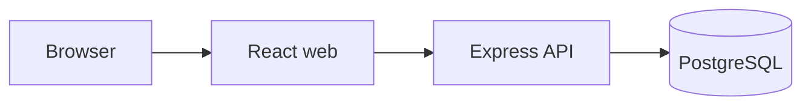
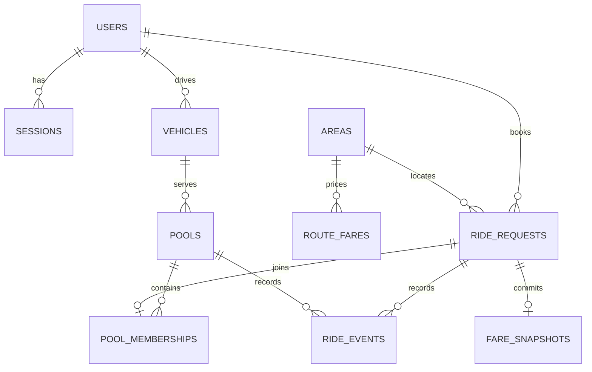

# Architecture and state contract

The React/TypeScript web application calls one Node.js/Express/TypeScript modular monolith over `/api/v1`. PostgreSQL owns durable accounts, sessions, vehicles, requests, pools, membership, fare snapshots and status events. Docker Compose runs web, API and PostgreSQL. No microservices, Redis, Kafka, queues, Kubernetes or external map API are part of the MVP.

Backend module boundaries: HTTP routes and validation -> auth/authorization -> requests, matching/capacity, fares, driver/trips -> repositories and PostgreSQL transactions. One transaction commits each multi-record business action; request and pool events are inserted alongside states. Frontend has passenger and driver routes, one session context and API client, and shared loading/error/empty feedback components. Driver OPEN-pool view must visibly label its member list **Relevant Ride Requests** and show names, pickup, destinations and seat counts.

## Planned relational schema

| Table | Principal columns | Constraints and indexes |
| --- | --- | --- |
| `users` | id, name, normalized_email, password_hash, role, created_at | unique email; role PASSENGER/DRIVER |
| `sessions` | id, user_id, token_hash, expires_at, revoked_at, created_at | unique token hash; FK user; expiry index |
| `areas` | id, code, name | unique code |
| `route_fares` | id, origin_area_id, destination_area_id, pricing_version, base_per_seat_poysha, zone_charge_poysha | FK areas, directed route/version unique, nonnegative charges; versioned base tariff retained for reproducibility |
| `vehicles` | id, driver_user_id, name, capacity_seats, is_online | FK driver, positive capacity, unique driver for MVP |
| `ride_requests` | id, passenger_user_id, pickup_area_id, destination_area_id, seats_requested, status, estimated_fare_poysha, pricing_version, payment_method, created_at, updated_at, cancelled_at | FK user/areas, 1..3 seats, distinct endpoints, unique active request per passenger, waiting/history indexes |
| `pools` | id, vehicle_id, pickup_area_id, status, created_at, accepted_at, arrived_at, started_at, completed_at, cancelled_at | FK vehicle/area; partial unique index on vehicle for nonterminal pools |
| `pool_memberships` | id, pool_id, ride_request_id, joined_at, released_at | FK pool/request; unique request ID; pool index; cancellation retains membership record |
| `fare_snapshots` | id, ride_request_id, pricing_version, seat_count, base_per_seat_poysha, zone_per_seat_poysha, discount_per_seat_poysha, total_poysha, committed_at | unique FK request; nonnegative money components |
| `ride_events` | id, ride_request_id, actor_user_id nullable, from_state, to_state, reason, occurred_at | request and pool events distinguished by entity_type with exactly one associated ID; indexed by entity/time |

All IDs are UUIDs and dates `timestamptz`. Cross-row vehicle capacity, matching eligibility, coordinated states and fare snapshots are transaction invariants, not claimed to be simple row checks.

Phase 3 stores a versioned standalone estimate and a creation/cancellation event in the same transaction as its request change. Pool memberships and pool events are introduced in Phase 4. Pre-match `REQUESTED` cancellation locks only the owned request row; once a request can join a pool, cancellation must use the vehicle → pool → request order described below.

## Two separate state machines

`RideRequest`: `REQUESTED -> MATCHED` (system); `MATCHED -> ACCEPTED` (driver pool acceptance); `ACCEPTED -> DRIVER_ARRIVED` (driver arrival); `DRIVER_ARRIVED -> STARTED` (driver trip start); `STARTED -> COMPLETED` (driver trip finish). Owning passenger may move `REQUESTED`, `MATCHED`, `ACCEPTED`, or `DRIVER_ARRIVED` directly to `CANCELLED`. Terminal states have no outgoing transitions.

`Pool`: creation -> `OPEN` (system); `OPEN -> ACCEPTED` (assigned driver); `ACCEPTED -> ARRIVED` (assigned driver); `ARRIVED -> IN_PROGRESS` (assigned driver); `IN_PROGRESS -> COMPLETED` (assigned driver). `OPEN`, `ACCEPTED`, or `ARRIVED` -> `CANCELLED` only as the system consequence of the final member cancelling. New riders can join only while the pool is `OPEN`; no cancellation after `IN_PROGRESS`. An individual rider cancellation while others remain does not change pool state.

Invalid and rejected: state skips; repeated actions; a passenger directly matching/accepting; a driver acting on another driver's pool; cancellation after start; acceptance of empty pool; accepting a stale/non-OPEN pool; arrival before acceptance; start before arrival; completion before start; transitions out of terminal states. Fail without partial writes or events.

## Atomic allocation and concurrent cancellation/acceptance

Use a single checked-out PostgreSQL client per transaction, `READ COMMITTED` and a consistent lock order: **vehicle row, pool row, then RideRequest row(s) ordered by request ID**. For a new pool, lock the vehicle before creating the pool; lock request rows before allocating. In allocation, explicitly `SELECT ... FOR UPDATE` the *candidate request* after vehicle and pool, then recheck `REQUESTED`, passenger ownership/one active request, supported route, pickup/destination compatibility, pool `OPEN`, vehicle online, existing memberships and seat totals. Update state and membership plus events only after the recheck. The active-request partial unique index is an additional protection; it does not replace the locked check. Creation commits the REQUESTED row and creation event first, then synchronous allocation runs in its own vehicle → pool → request transaction and re-reads the request. A full or unavailable vehicle leaves it REQUESTED/waiting; the 201 response reads the committed outcome. New pool creation under the vehicle lock precedes request-row locking, with the new pool and its event rolled back if eligibility fails.

Pool acceptance: lock vehicle -> pool -> **all currently active member RideRequest rows in deterministic ID order**; after locks, reread membership and states. If pool is not `OPEN` or no active members, reject. The vehicle/pool locks serialize membership changes, so the active membership set is frozen while accepting. Compute discount from that frozen set, insert one immutable fare snapshot per active request, move each request to `ACCEPTED`, move pool to `ACCEPTED`, and append all request and pool events **within the same transaction**. A failure rolls all of them back. No join after acceptance.

Passenger cancellation: resolve pool ID without locking as a hint; then lock vehicle -> pool -> **the target request and any other request rows that must be changed, by ID**; reread request/pool/membership after locks. If the request was already cancelled, started or completed, reject without writes. Set target request `CANCELLED`, mark membership `released_at`, append request event, and, if no active members remain, move pre-start pool to `CANCELLED` and append pool event. All changes commit atomically. If the request was still `REQUESTED` without a pool, lock and update that request alone. Concurrent acceptance and cancellation serialize on vehicle/pool: whichever commits first determines the permitted next action; acceptance cannot price a cancelled passenger and cancellation cannot leave a priced active passenger without a consistent state. If the preliminary pool ID became stale, restart transaction lookup instead of locking in reverse order. Retry waiting requests after committing seat release, in a new transaction.

In the controlled concurrency test, two separate connections simultaneously claim a pool with two reserved seats. Exactly one candidate becomes `MATCHED` and the other remains `REQUESTED`/waiting; reserved total is always <= 3, with matching events consistent with both states.

## Authorization and security

Passenger: own request and fare/history only, own pre-start cancellation, no driver actions. Assigned driver: own vehicle availability, assigned pool and relevant members, accept/arrive/start/complete, no passenger private fare/history endpoint. System alone runs matching and records events. Derive actor and role from the server session, never a client-supplied user ID. Public: passenger registration and login, liveness, readiness and listed areas. Other private resources return 404 or 403 without leaking personal details.

Cookie/session and password decisions are frozen in [assumptions.md](assumptions.md). Logs are structured JSON per request with request ID, HTTP method and route template, status, safe actor/user ID, relevant pool/request IDs, error code and duration milliseconds. Log event/error context without request bodies. Explicitly exclude passwords, authorization headers, session tokens, cookies, `.env` values and other secrets; never log raw SQL parameters that may carry personal or session data. Avoid exposing personal names/emails in routine logs. A request ID is returned in a response header to correlate failures.

## Quality and delivery

Automated behavior tests must cover Bullet's seat capacity, invalid transitions, Nusrat/Rafiq pooled fare, cross-user modification denial, cancellation policy, and two concurrent last-seat claims. README will include architecture/ERD, tech decisions and alternatives, setup/Docker/migration/seed, tests, credentials, limitations, AI usage and video link. Git uses `feature/*` -> `master` -> `pre-release` -> `release/v1.0.0`, never cutting the release early. Public deployment is preferred, always free; provide Docker instructions if free backend hosting is unavailable.
